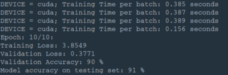
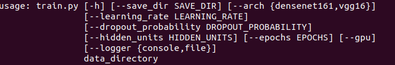
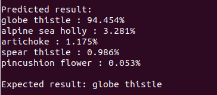

# MachineLearning-ImageClassifier
This project is an image classifier project using machine learning implemented via the pytorch python library. 

The project is a standalone python application to train and predict images. It is implemented using the pytorch, and it uses pre-trained neuronal networks models (form ImageNet) with a classifier of your choice. The pre-trained model is used to detect the image features, which are then fed to your classifer to predict an image. You can choose either densenet161 or vgg16 as pre-trained model, and can assign it a classifier with arbitrary number of hidden layers to appropriately classify your images. 

The project was applied on 102 species of flowers. As the picture below shows, very good results were achieved.


## Usage
To use this project, all what you need to do is to split your imageset into three parts, training, validation, and testing similar to the attached flowers dataset, i.e., flowers->(train,valid,test)->classes(1,2,3,4,5)->images. Then, you can create, train, tune, and save your model in one shot using `train.py`. Afterwards, you can load the model anytime and predict new images using `predict.py`.

## Train

#### Example Command
```
python train.py flowers --save_dir checkpoints --arch densenet161 --hidden_units 1024,512 --learning_rate 0.001 --dropout_probability 0.5 --epochs 10 --logger file --gpu 
```


#### Train options
The command above will use default values for all other values than the data_directory(images folder path). See below what options are available.



## Predict
## Example Command
```
python predict.py flowers/test/10/image_07090.jpg checkpoints/checkpointNLLLossAdam10 --top_k 5 --category_names cat_to_name.json --logger file --gpu
```


#### Predict options
The command above will use default values for all other values than the image_file (the image to predict) and model_file (the saved model to use for prediction). See below for how to customize these values.


